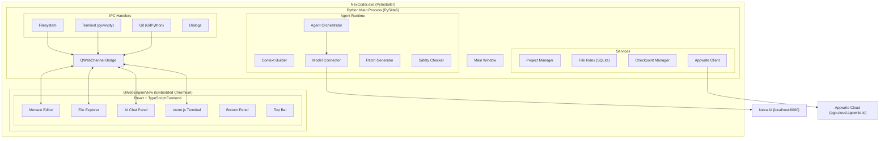

# NexCoder Desktop — Cursor-Style AI Coding Editor (Python)

Build NexCoder as a **Python desktop .exe** — a Cursor-style AI-first code editor for the Nexa ecosystem, powered by Nexa AI models and connected to the Nexa Appwrite backend.

## Architecture Overview



## Key Architecture Decisions

| Decision | Choice | Rationale |
|---|---|---|
| **Desktop Shell** | PySide6 (Qt for Python) | Native Python, robust windowing, QWebEngineView for Monaco |
| **Editor Rendering** | QWebEngineView + React | Monaco Editor requires Chromium; React gives Cursor-like UI fidelity |
| **IPC Mechanism** | QWebChannel | Qt's built-in Python↔JavaScript bridge (replaces Electron IPC) |
| **Terminal PTY** | pywinpty (Windows) / pty (Unix) | Native Python PTY, data relayed to xterm.js via QWebChannel |
| **AI Backend** | Direct HTTP to Nexa AI | Reuse existing Nexa backend at `http://127.0.0.1:8000` |
| **Appwrite SDK** | `appwrite` Python SDK | Python-native, runs in main process |
| **Git** | GitPython | Python-native git operations, no shell dependency |
| **Local Index** | SQLite (built-in) | File indexing, search, embeddings storage |
| **Packaging** | PyInstaller → .exe | Single distributable Windows executable |

---

## User Review Required

> [!IMPORTANT]
> **Existing Nexa Appwrite Found**: I discovered your full Appwrite setup at `C:\Nexa Web`:
> - **Endpoint**: `https://sgp.cloud.appwrite.io/v1`
> - **Project ID**: `6a1c615b001a7362068c`
> - **Database ID**: `6a1c7a78001a6b9ae413`
> - **19 existing collections** (conversations, messages, billing, etc.)
> - **AI Backend**: FastAPI + Qwen3 at `http://127.0.0.1:8000`
>
> I will add the NexCoder-specific collections (`nexcoder_projects`, `nexcoder_sessions`, `nexcoder_tasks`, `nexcoder_messages`, `nexcoder_rules`, `nexcoder_usage`) alongside the existing ones. Credentials will be read from a `.env` file.

> [!IMPORTANT]
> **AI Model Integration**: Your Nexa backend at `d:\Nexa` uses FastAPI + Qwen3-4B at `http://127.0.0.1:8000`. I will build the model connector to use an **OpenAI-compatible chat completions interface** so it works with:
> - Your local Nexa AI endpoint
> - Any OpenAI-compatible API (ollama, vllm, etc.)
> - OpenAI/Anthropic as fallback (configurable)

> [!WARNING]
> **App Size**: PySide6 + QWebEngineView bundles Chromium (~150–200MB installed). This is comparable to Electron-based apps like Cursor/VS Code. The resulting .exe will be ~200–300MB. This is standard for this class of application. If you need a lighter binary later, we can switch to `pywebview` + EdgeWebView2 (uses system Chromium, ~20MB).

## Open Questions

1. **Nexa AI API Format**: Is the Nexa backend at `:8000` OpenAI-compatible (`/v1/chat/completions`) or does it have a custom API? I'll default to OpenAI-compatible.
2. **Python Version**: Should we target Python 3.11 or 3.12 for PyInstaller compatibility?
3. **Appwrite Credentials**: Should I copy the credentials from `C:\Nexa Web\.env.local`, or do you want a separate API key for NexCoder?
4. **Code Signing**: Do you need Windows code signing for distribution, or is unsigned dev-mode sufficient for now?

---

## Tech Stack

| Layer | Technology | Purpose |
|---|---|---|
| Desktop Shell | PySide6 6.x | Window management, native menus, system tray |
| Web View | QWebEngineView | Hosts React frontend + Monaco Editor |
| IPC Bridge | QWebChannel | Python ↔ JavaScript communication |
| Frontend | React 19 + TypeScript | Cursor-like UI components |
| Code Editor | Monaco Editor (`@monaco-editor/react`) | Syntax highlighting, tabs, IntelliSense |
| Terminal UI | xterm.js (`@xterm/xterm`) | Terminal rendering in web view |
| Terminal Backend | pywinpty / pty | Native PTY process management |
| State Management | Zustand | Frontend state |
| Styling | Vanilla CSS (dark theme) | Cursor-inspired design system |
| AI Model | httpx (async HTTP) | OpenAI-compatible API calls |
| Appwrite | `appwrite` Python SDK | Auth, database, storage |
| Git | GitPython | Version control operations |
| Local DB | sqlite3 (stdlib) | File index, search, embeddings |
| File Watching | watchdog | Live file tree updates |
| Packaging | PyInstaller | .exe distribution |
| Frontend Build | Vite | Bundle React app for embedding |
| Fonts | JetBrains Mono, Inter | Code + UI typography |
| Icons | Lucide React | UI iconography |

---

## Proposed Changes

### Phase 1 — Python Desktop Shell + Full UI

This phase delivers the complete application: Python .exe with PySide6 window, embedded React frontend with all Cursor-like panels, Monaco editor, file explorer, terminal, and AI chat panel.

---

#### Project Root — Configuration

##### [NEW] [pyproject.toml](file:///d:/NexCoder/pyproject.toml)
- Python project metadata
- Dependencies: PySide6, PyQtWebEngine, pywinpty, GitPython, httpx, watchdog, appwrite, python-dotenv
- Build system config
- Entry point: `nexcoder.main:main`

##### [NEW] [requirements.txt](file:///d:/NexCoder/requirements.txt)
- Pinned dependency versions for reproducible builds

##### [NEW] [.env.example](file:///d:/NexCoder/.env.example)
- Template for Appwrite and Nexa AI credentials

##### [NEW] [.gitignore](file:///d:/NexCoder/.gitignore)
- Python, Node, build artifacts, .env, __pycache__, dist/

---

#### Python Main Process — Application Shell

##### [NEW] [nexcoder/main.py](file:///d:/NexCoder/nexcoder/main.py)
- Entry point
- QApplication setup
- High DPI scaling
- Dark palette
- Splash screen
- Launch main window

##### [NEW] [nexcoder/app.py](file:///d:/NexCoder/nexcoder/app.py)
- `MainWindow(QMainWindow)` class
- QWebEngineView as central widget
- Load bundled React app from `resources/ui/index.html`
- QWebChannel setup — register all Python IPC handlers
- Native menu bar (File, Edit, View, Terminal, Help)
- Window state persistence (geometry, maximized)
- Window title: "NexCoder — {project_name}"
- Icon, minimum size (1200×800)

##### [NEW] [nexcoder/bridge.py](file:///d:/NexCoder/nexcoder/bridge.py)
- `Bridge(QObject)` — the master IPC bridge exposed to JavaScript
- `@Slot` decorated methods callable from React frontend
- Signal emissions to push data to JavaScript
- Delegates to individual IPC handlers
- Thread-safe signal/slot communication
- Methods:
  - `open_folder_dialog()` → opens native folder picker
  - `read_file(path)` → returns file content
  - `write_file(path, content)` → writes file
  - `delete_file(path)` → deletes with confirmation
  - `rename_file(old, new)` → renames
  - `create_directory(path)` → mkdir
  - `get_file_tree(root)` → returns JSON tree
  - `search_files(query, root)` → grep-like search
  - `spawn_terminal(cwd)` → starts PTY session
  - `write_terminal(session_id, data)` → writes to PTY
  - `resize_terminal(session_id, cols, rows)` → resizes PTY
  - `kill_terminal(session_id)` → kills PTY
  - `git_status(root)` → returns git status
  - `git_diff(root)` → returns diff
  - `git_stage(root, files)` → stages files
  - `git_commit(root, message)` → commits
  - `git_branch(root)` → returns current branch
  - `git_log(root, count)` → returns recent commits
  - `agent_ask(prompt, context)` → AI ask mode
  - `agent_edit(prompt, context)` → AI edit mode
  - `agent_run(prompt, context)` → AI agent mode
  - `agent_debug(prompt, context)` → AI debug mode
  - `agent_review(prompt, context)` → AI review mode
  - `save_to_appwrite(collection, data)` → persist to cloud

---

#### Python IPC Handlers

##### [NEW] [nexcoder/ipc/__init__.py](file:///d:/NexCoder/nexcoder/ipc/__init__.py)

##### [NEW] [nexcoder/ipc/filesystem.py](file:///d:/NexCoder/nexcoder/ipc/filesystem.py)
- `FileSystemHandler` class
- `read_file(path)` — read text/binary detection, encoding handling
- `write_file(path, content)` — atomic write (write to temp, then rename)
- `delete_path(path)` — delete file or directory
- `rename_path(old, new)` — rename/move
- `create_directory(path)` — mkdir -p
- `get_file_tree(root)` — recursive directory listing, `.gitignore`-aware
- `search_files(query, root)` — ripgrep-style search through files
- `watch_directory(root, callback)` — watchdog observer for live updates
- `get_file_stats(path)` — size, modified time, type
- Binary file detection (images, compiled, etc.)
- Skip: `node_modules`, `.git`, `__pycache__`, `venv`, `.nexcoder/`

##### [NEW] [nexcoder/ipc/terminal.py](file:///d:/NexCoder/nexcoder/ipc/terminal.py)
- `TerminalHandler` class
- Map of `session_id → PTY process`
- `spawn(cwd)` — create pywinpty process (PowerShell on Windows, bash on Unix)
- `write(session_id, data)` — write stdin to PTY
- `resize(session_id, cols, rows)` — resize PTY
- `kill(session_id)` — terminate PTY
- Background thread reads PTY output, emits Qt signal → QWebChannel → xterm.js
- **Safety**: command validation before execution
- Blocked commands: `rm -rf /`, `del /s /q C:\`, `format`, `diskpart`, etc.

##### [NEW] [nexcoder/ipc/git_ops.py](file:///d:/NexCoder/nexcoder/ipc/git_ops.py)
- `GitHandler` class using GitPython
- `status(root)` — changed/staged/untracked files
- `diff(root, staged=False)` — unified diff
- `stage(root, files)` — git add
- `unstage(root, files)` — git reset
- `commit(root, message)` — git commit
- `branch(root)` — current branch name
- `branches(root)` — all local branches
- `log(root, count=20)` — recent commits
- `init(root)` — git init if needed
- Error handling for non-git directories

##### [NEW] [nexcoder/ipc/dialogs.py](file:///d:/NexCoder/nexcoder/ipc/dialogs.py)
- `DialogHandler` class
- Native Qt file/folder dialogs
- Confirmation dialogs for destructive operations
- Message boxes for errors/info

---

#### Python Agent Runtime

##### [NEW] [nexcoder/agent/__init__.py](file:///d:/NexCoder/nexcoder/agent/__init__.py)

##### [NEW] [nexcoder/agent/runtime.py](file:///d:/NexCoder/nexcoder/agent/runtime.py)
- `AgentRuntime` class — main orchestrator
- Dispatches to mode handlers (ask, edit, agent, debug, review)
- Manages conversation history
- Streaming response via Qt signals
- Thread pool for async operations

##### [NEW] [nexcoder/agent/context_builder.py](file:///d:/NexCoder/nexcoder/agent/context_builder.py)
- Build context window for AI queries
- Read current file, selected code, related files
- Project structure summary
- Respect token limits (configurable, default 8K context)
- File relevance scoring

##### [NEW] [nexcoder/agent/model_connector.py](file:///d:/NexCoder/nexcoder/agent/model_connector.py)
- `ModelConnector` class
- OpenAI-compatible chat completions API (`/v1/chat/completions`)
- Configurable endpoint: defaults to `http://127.0.0.1:8000`
- Streaming SSE response parsing
- Async HTTP via `httpx`
- System prompt management per mode
- Token counting (tiktoken or approximate)

##### [NEW] [nexcoder/agent/patch_generator.py](file:///d:/NexCoder/nexcoder/agent/patch_generator.py)
- Parse AI model output for code changes
- Generate unified diff format
- Support for:
  - Single-file patches
  - Multi-file patches
  - New file creation
  - File deletion
- Validate patches against current file state
- Apply patch to file system (after approval)

##### [NEW] [nexcoder/agent/safety.py](file:///d:/NexCoder/nexcoder/agent/safety.py)
- Command blocklist (destructive commands)
- Sensitive file detection (`.env`, auth modules, payment code)
- Approval requirement matrix:
  - Always approve: delete, install, network, .env, auth/payment, migrations, push, commit, large patches
- Risk scoring for patches (lines changed, files affected, sensitivity)
- Secrets detection in chat output

##### [NEW] [nexcoder/agent/error_parser.py](file:///d:/NexCoder/nexcoder/agent/error_parser.py)
- Parse common error formats from terminal output
- Supported: Python tracebacks, TypeScript/ESLint, Rust, Go, Java, C++
- Extract: file path, line number, error message, error type
- Map to "Fix" suggestions

##### [NEW] [nexcoder/agent/modes/__init__.py](file:///d:/NexCoder/nexcoder/agent/modes/__init__.py)

##### [NEW] [nexcoder/agent/modes/ask.py](file:///d:/NexCoder/nexcoder/agent/modes/ask.py)
- Read-only mode — no file modifications
- Gather context → build prompt → stream response
- Use cases: explain code, answer questions, find files, summarize architecture

##### [NEW] [nexcoder/agent/modes/edit.py](file:///d:/NexCoder/nexcoder/agent/modes/edit.py)
- Controlled edit mode
- Generate single-file patch → show diff → wait for approval → apply
- Use cases: small fixes, component changes, function rewrites

##### [NEW] [nexcoder/agent/modes/agent_mode.py](file:///d:/NexCoder/nexcoder/agent/modes/agent_mode.py)
- Multi-step autonomous mode
- Steps: read task → inspect files → create plan → identify changes → generate patches → show diffs → apply approved → run tests → fix errors → summarize
- Creates checkpoint before changes
- Rollback on failure

##### [NEW] [nexcoder/agent/modes/debug.py](file:///d:/NexCoder/nexcoder/agent/modes/debug.py)
- Error-focused mode
- Parse terminal errors → find source files → propose fixes
- Auto-fix loop (with approval)

##### [NEW] [nexcoder/agent/modes/review.py](file:///d:/NexCoder/nexcoder/agent/modes/review.py)
- Code audit mode
- Analyze files for: security issues, code quality, performance, architecture
- Generate structured review report

---

#### Python Services

##### [NEW] [nexcoder/services/__init__.py](file:///d:/NexCoder/nexcoder/services/__init__.py)

##### [NEW] [nexcoder/services/project_manager.py](file:///d:/NexCoder/nexcoder/services/project_manager.py)
- Open project (validate path, detect framework/language/package manager)
- Recent projects list (persisted to `~/.nexcoder/recent_projects.json`)
- `.nexcoder/` project config directory
- Framework detection: package.json → Node, pyproject.toml → Python, Cargo.toml → Rust, etc.

##### [NEW] [nexcoder/services/file_index.py](file:///d:/NexCoder/nexcoder/services/file_index.py)
- SQLite-based file index (stored in `.nexcoder/index.db`)
- Index: file paths, sizes, modified times, content hashes
- Full-text search (FTS5)
- Incremental updates on watchdog events
- Background indexing thread

##### [NEW] [nexcoder/services/checkpoint.py](file:///d:/NexCoder/nexcoder/services/checkpoint.py)
- Create checkpoint before edits (copy files to `.nexcoder/checkpoints/{timestamp}/`)
- Restore checkpoint
- List checkpoints with metadata
- Auto-cleanup: keep last 10 checkpoints
- Per-file restore capability

##### [NEW] [nexcoder/services/appwrite_client.py](file:///d:/NexCoder/nexcoder/services/appwrite_client.py)
- Appwrite Python SDK initialization
- Auth: login, register, logout, session check, get current user
- Database CRUD for all NexCoder collections:
  - `nexcoder_projects` — project metadata
  - `nexcoder_sessions` — chat/task sessions
  - `nexcoder_messages` — conversation history
  - `nexcoder_tasks` — agent tasks
  - `nexcoder_rules` — project rules
  - `nexcoder_usage` — usage tracking
- Connection config from `.env` file
- Offline-first: queue writes when offline, sync when back online
- Uses existing Nexa Appwrite: endpoint `https://sgp.cloud.appwrite.io/v1`, project `6a1c615b001a7362068c`, database `6a1c7a78001a6b9ae413`

---

#### React Frontend (Embedded in QWebEngineView)

The frontend is built with Vite and bundled into `nexcoder/resources/ui/`. PySide6 loads `index.html` from this directory. Communication with Python uses QWebChannel.

##### [NEW] [nexcoder/ui/package.json](file:///d:/NexCoder/nexcoder/ui/package.json)
- Dependencies: react, react-dom, @monaco-editor/react, @xterm/xterm, @xterm/addon-fit, zustand, lucide-react
- Scripts: dev, build (outputs to `../resources/ui/`)
- TypeScript, Vite

##### [NEW] [nexcoder/ui/vite.config.ts](file:///d:/NexCoder/nexcoder/ui/vite.config.ts)
- Build output: `../resources/ui/`
- Base: `./` (relative paths for file:// loading)
- Monaco Editor worker plugin

##### [NEW] [nexcoder/ui/tsconfig.json](file:///d:/NexCoder/nexcoder/ui/tsconfig.json)
- Strict mode, React JSX transform, path aliases

##### [NEW] [nexcoder/ui/index.html](file:///d:/NexCoder/nexcoder/ui/index.html)
- Root HTML, dark background, font loading
- QWebChannel.js script include

##### [NEW] [nexcoder/ui/src/main.tsx](file:///d:/NexCoder/nexcoder/ui/src/main.tsx)
- React root mount
- QWebChannel initialization — connect to Python bridge
- Store bridge reference globally

##### [NEW] [nexcoder/ui/src/App.tsx](file:///d:/NexCoder/nexcoder/ui/src/App.tsx)
- Master layout: TopBar + Sidebar + EditorArea + AIPanel + BottomPanel
- Resizable panels with drag handles (CSS grid + resize)
- Panel visibility toggles
- Keyboard shortcuts (Ctrl+`, Ctrl+B, Ctrl+Shift+E, etc.)

##### [NEW] [nexcoder/ui/src/index.css](file:///d:/NexCoder/nexcoder/ui/src/index.css)
- Complete dark design system (Cursor-inspired):
  - Background: `#0e0e14` (deep dark), `#16161e` (panels)
  - Surface: `#1a1a26`, `#1e1e2e`
  - Border: `#2a2a3a`
  - Text: `#e0e0e8` (primary), `#8888a0` (secondary)
  - Accent: `#6c5ce7` (purple), `#00b894` (green), `#e17055` (red)
  - Highlights: `#2d2d44` (hover), `#3d3d5c` (active)
- Typography: JetBrains Mono for code, Inter for UI
- Scrollbar styling (thin, dark)
- Panel layout grid
- Transitions and animations

##### [NEW] [nexcoder/ui/src/services/bridge.ts](file:///d:/NexCoder/nexcoder/ui/src/services/bridge.ts)
- TypeScript wrapper around QWebChannel Python bridge
- Typed async methods matching Python `Bridge` class
- Promise-based API (wraps QWebChannel callbacks)
- Event listeners for Python → JS signals (terminal output, file changes, agent streaming)

---

##### React Components — Top Bar

##### [NEW] [nexcoder/ui/src/components/TopBar/TopBar.tsx](file:///d:/NexCoder/nexcoder/ui/src/components/TopBar/TopBar.tsx)
- Project name display
- Git branch badge
- Model selector dropdown (Nexa models)
- Run button (detected build command)
- Commit button
- Settings gear icon

##### [NEW] [nexcoder/ui/src/components/TopBar/TopBar.css](file:///d:/NexCoder/nexcoder/ui/src/components/TopBar/TopBar.css)

##### [NEW] [nexcoder/ui/src/components/TopBar/BranchBadge.tsx](file:///d:/NexCoder/nexcoder/ui/src/components/TopBar/BranchBadge.tsx)
- Current branch name with git icon

##### [NEW] [nexcoder/ui/src/components/TopBar/ModelSelector.tsx](file:///d:/NexCoder/nexcoder/ui/src/components/TopBar/ModelSelector.tsx)
- Dropdown: Nexa Default, Nexa Fast, Nexa Pro, Custom

---

##### React Components — Sidebar

##### [NEW] [nexcoder/ui/src/components/Sidebar/Sidebar.tsx](file:///d:/NexCoder/nexcoder/ui/src/components/Sidebar/Sidebar.tsx)
- Tab-based: Explorer, Search, Git, Tasks
- Collapsible with Ctrl+B toggle

##### [NEW] [nexcoder/ui/src/components/Sidebar/Sidebar.css](file:///d:/NexCoder/nexcoder/ui/src/components/Sidebar/Sidebar.css)

##### [NEW] [nexcoder/ui/src/components/Sidebar/FileExplorer.tsx](file:///d:/NexCoder/nexcoder/ui/src/components/Sidebar/FileExplorer.tsx)
- Recursive tree view
- File-type icons (color-coded)
- Click → open in editor
- Right-click context menu (New File, New Folder, Rename, Delete, Copy Path)
- Expand/collapse folders
- Filter/search at top
- "Open Folder" button when empty

##### [NEW] [nexcoder/ui/src/components/Sidebar/FileTreeItem.tsx](file:///d:/NexCoder/nexcoder/ui/src/components/Sidebar/FileTreeItem.tsx)
- Individual tree node
- Depth-based indentation
- File/folder icon
- Hover/active highlighting

##### [NEW] [nexcoder/ui/src/components/Sidebar/SearchPanel.tsx](file:///d:/NexCoder/nexcoder/ui/src/components/Sidebar/SearchPanel.tsx)
- Project-wide text search
- Results grouped by file
- Click → open at line
- Regex/case toggles

##### [NEW] [nexcoder/ui/src/components/Sidebar/GitPanel.tsx](file:///d:/NexCoder/nexcoder/ui/src/components/Sidebar/GitPanel.tsx)
- Changed files (staged/unstaged)
- Stage/unstage buttons
- Commit message input + commit button

##### [NEW] [nexcoder/ui/src/components/Sidebar/TasksPanel.tsx](file:///d:/NexCoder/nexcoder/ui/src/components/Sidebar/TasksPanel.tsx)
- Active agent tasks with status indicators

---

##### React Components — Editor Area

##### [NEW] [nexcoder/ui/src/components/Editor/EditorArea.tsx](file:///d:/NexCoder/nexcoder/ui/src/components/Editor/EditorArea.tsx)
- Tab bar + Monaco viewport
- Welcome screen when no files open
- Dirty indicator on unsaved tabs

##### [NEW] [nexcoder/ui/src/components/Editor/EditorArea.css](file:///d:/NexCoder/nexcoder/ui/src/components/Editor/EditorArea.css)

##### [NEW] [nexcoder/ui/src/components/Editor/EditorTabs.tsx](file:///d:/NexCoder/nexcoder/ui/src/components/Editor/EditorTabs.tsx)
- Horizontal tab bar with close buttons
- Active tab highlight
- Middle-click to close
- Scroll overflow

##### [NEW] [nexcoder/ui/src/components/Editor/MonacoEditor.tsx](file:///d:/NexCoder/nexcoder/ui/src/components/Editor/MonacoEditor.tsx)
- `@monaco-editor/react` wrapper
- Custom dark theme matching NexCoder palette
- Auto language detection by extension
- Ctrl+S → calls Python bridge `write_file`
- Right-click "Ask NexCoder" context menu action
- Selected text exposed to AI panel

##### [NEW] [nexcoder/ui/src/components/Editor/WelcomeScreen.tsx](file:///d:/NexCoder/nexcoder/ui/src/components/Editor/WelcomeScreen.tsx)
- NexCoder logo + tagline
- "Open Folder" button
- Recent projects list
- Keyboard shortcuts reference

##### [NEW] [nexcoder/ui/src/components/Editor/DiffViewer.tsx](file:///d:/NexCoder/nexcoder/ui/src/components/Editor/DiffViewer.tsx)
- Monaco DiffEditor for side-by-side diffs
- Accept/Reject buttons per file
- Apply All / Reject All

---

##### React Components — AI Chat Panel

##### [NEW] [nexcoder/ui/src/components/AIPanel/AIPanel.tsx](file:///d:/NexCoder/nexcoder/ui/src/components/AIPanel/AIPanel.tsx)
- Right-side resizable panel
- Mode tabs: Ask, Edit, Debug, Agent, Review, Test
- Message list + input area
- Context chips (current file, selection)
- Streaming response display

##### [NEW] [nexcoder/ui/src/components/AIPanel/AIPanel.css](file:///d:/NexCoder/nexcoder/ui/src/components/AIPanel/AIPanel.css)

##### [NEW] [nexcoder/ui/src/components/AIPanel/ChatMessage.tsx](file:///d:/NexCoder/nexcoder/ui/src/components/AIPanel/ChatMessage.tsx)
- User/assistant message bubbles
- Markdown rendering with syntax-highlighted code blocks
- Copy code button
- "Apply" button on code blocks

##### [NEW] [nexcoder/ui/src/components/AIPanel/ChatInput.tsx](file:///d:/NexCoder/nexcoder/ui/src/components/AIPanel/ChatInput.tsx)
- Multi-line textarea, Enter to send, Shift+Enter for newline
- Attach file button
- Mode-specific placeholder text

##### [NEW] [nexcoder/ui/src/components/AIPanel/ModeSelector.tsx](file:///d:/NexCoder/nexcoder/ui/src/components/AIPanel/ModeSelector.tsx)
- Horizontal mode tabs with icons

##### [NEW] [nexcoder/ui/src/components/AIPanel/AgentTimeline.tsx](file:///d:/NexCoder/nexcoder/ui/src/components/AIPanel/AgentTimeline.tsx)
- Step-by-step progress: Reading → Planning → Editing → Testing → Done
- Expandable details per step
- Changed files list
- Approve/Reject buttons

---

##### React Components — Bottom Panel

##### [NEW] [nexcoder/ui/src/components/BottomPanel/BottomPanel.tsx](file:///d:/NexCoder/nexcoder/ui/src/components/BottomPanel/BottomPanel.tsx)
- Tab bar: Terminal, Output, Problems, Git Diff
- Collapsible with drag handle
- Ctrl+` toggle

##### [NEW] [nexcoder/ui/src/components/BottomPanel/BottomPanel.css](file:///d:/NexCoder/nexcoder/ui/src/components/BottomPanel/BottomPanel.css)

##### [NEW] [nexcoder/ui/src/components/BottomPanel/TerminalTab.tsx](file:///d:/NexCoder/nexcoder/ui/src/components/BottomPanel/TerminalTab.tsx)
- xterm.js instance
- Connected to Python PTY via QWebChannel
- FitAddon for resize
- Dark theme
- New terminal (+) and kill buttons

##### [NEW] [nexcoder/ui/src/components/BottomPanel/OutputTab.tsx](file:///d:/NexCoder/nexcoder/ui/src/components/BottomPanel/OutputTab.tsx)
- Build/test output log
- Scrollable, auto-scroll

##### [NEW] [nexcoder/ui/src/components/BottomPanel/ProblemsTab.tsx](file:///d:/NexCoder/nexcoder/ui/src/components/BottomPanel/ProblemsTab.tsx)
- Error/warning list with severity icons
- Click → open file at line
- "Ask NexCoder to Fix" button

##### [NEW] [nexcoder/ui/src/components/BottomPanel/GitDiffTab.tsx](file:///d:/NexCoder/nexcoder/ui/src/components/BottomPanel/GitDiffTab.tsx)
- Full git diff output, syntax-highlighted

---

##### React Components — Auth & Settings

##### [NEW] [nexcoder/ui/src/components/Auth/LoginScreen.tsx](file:///d:/NexCoder/nexcoder/ui/src/components/Auth/LoginScreen.tsx)
- Email/password login
- Register form
- "Continue without account" (local-only mode)
- Nexa branding

##### [NEW] [nexcoder/ui/src/components/Auth/LoginScreen.css](file:///d:/NexCoder/nexcoder/ui/src/components/Auth/LoginScreen.css)

##### [NEW] [nexcoder/ui/src/components/Settings/SettingsPage.tsx](file:///d:/NexCoder/nexcoder/ui/src/components/Settings/SettingsPage.tsx)
- Account info, AI model config, editor prefs, Appwrite settings, privacy (cloud sync toggle), About

---

##### React State Management

##### [NEW] [nexcoder/ui/src/store/useProjectStore.ts](file:///d:/NexCoder/nexcoder/ui/src/store/useProjectStore.ts)
- `projectPath`, `projectName`, `fileTree`, `openFiles`, `activeFile`

##### [NEW] [nexcoder/ui/src/store/useEditorStore.ts](file:///d:/NexCoder/nexcoder/ui/src/store/useEditorStore.ts)
- Dirty files, cursor positions, tab order

##### [NEW] [nexcoder/ui/src/store/useChatStore.ts](file:///d:/NexCoder/nexcoder/ui/src/store/useChatStore.ts)
- Messages, active mode, streaming state

##### [NEW] [nexcoder/ui/src/store/useTerminalStore.ts](file:///d:/NexCoder/nexcoder/ui/src/store/useTerminalStore.ts)
- Terminal sessions, active terminal

##### [NEW] [nexcoder/ui/src/store/useSettingsStore.ts](file:///d:/NexCoder/nexcoder/ui/src/store/useSettingsStore.ts)
- User preferences (persisted to localStorage)

##### [NEW] [nexcoder/ui/src/store/useGitStore.ts](file:///d:/NexCoder/nexcoder/ui/src/store/useGitStore.ts)
- Branch, changed files, staged files

---

##### React Utilities & Types

##### [NEW] [nexcoder/ui/src/utils/fileIcons.ts](file:///d:/NexCoder/nexcoder/ui/src/utils/fileIcons.ts)
- File extension → icon/color map

##### [NEW] [nexcoder/ui/src/utils/languageMap.ts](file:///d:/NexCoder/nexcoder/ui/src/utils/languageMap.ts)
- Extension → Monaco language ID

##### [NEW] [nexcoder/ui/src/utils/formatters.ts](file:///d:/NexCoder/nexcoder/ui/src/utils/formatters.ts)
- File size, relative time, path utilities

##### [NEW] [nexcoder/ui/src/types/index.ts](file:///d:/NexCoder/nexcoder/ui/src/types/index.ts)
- FileNode, ChatMessage, AgentTask, DiffHunk, TerminalSession, Project

##### [NEW] [nexcoder/ui/src/types/bridge.d.ts](file:///d:/NexCoder/nexcoder/ui/src/types/bridge.d.ts)
- Type declarations for the Python QWebChannel bridge

---

#### Build & Packaging

##### [NEW] [nexcoder/resources/icon.ico](file:///d:/NexCoder/nexcoder/resources/icon.ico)
- NexCoder app icon

##### [NEW] [build.py](file:///d:/NexCoder/build.py)
- Build script:
  1. Build React frontend (`npm run build` in `nexcoder/ui/`)
  2. Run PyInstaller to package Python + resources into .exe
  
##### [NEW] [nexcoder.spec](file:///d:/NexCoder/nexcoder.spec)
- PyInstaller spec file
- Include: PySide6, QWebEngine, resources/ui/ (built React app), .env
- One-file mode or one-dir mode
- Windows icon, version info

---

### Phase 2 — Enhanced Local Project System

##### [MODIFY] [nexcoder/ipc/filesystem.py](file:///d:/NexCoder/nexcoder/ipc/filesystem.py)
- Add watchdog file watcher for live tree updates
- Binary file detection, large file handling (skip > 1MB for indexing)
- `.gitignore`-aware tree building

##### [MODIFY] [nexcoder/services/project_manager.py](file:///d:/NexCoder/nexcoder/services/project_manager.py)
- Framework auto-detection (Node, Python, Rust, Go, Java)
- Package manager detection (npm, yarn, pnpm, pip, poetry, cargo)
- Build command detection

---

### Phase 3 — Appwrite Integration

##### [NEW] [scripts/setup_appwrite_collections.py](file:///d:/NexCoder/scripts/setup_appwrite_collections.py)
- Script to create NexCoder-specific collections in existing Nexa database
- Creates: `nexcoder_projects`, `nexcoder_sessions`, `nexcoder_messages`, `nexcoder_tasks`, `nexcoder_rules`, `nexcoder_usage`
- Sets up attributes and indexes
- Safe: checks if collections exist before creating

##### [MODIFY] [nexcoder/services/appwrite_client.py](file:///d:/NexCoder/nexcoder/services/appwrite_client.py)
- Wire all collection CRUD operations
- Auth flow: login → session token → persist
- Sync project metadata on open/close
- Save chat sessions automatically
- Usage tracking (increment on each agent call)

---

### Phase 4 — Agent Runtime Enhancement

Enhance the agent modes with real model integration and sophisticated context building.

##### [MODIFY] [nexcoder/agent/context_builder.py](file:///d:/NexCoder/nexcoder/agent/context_builder.py)
- SQLite FTS5 search for relevant files
- File relevance scoring based on imports, references
- Smart context window packing

##### [MODIFY] [nexcoder/agent/model_connector.py](file:///d:/NexCoder/nexcoder/agent/model_connector.py)
- Full streaming with progress reporting
- Multiple model support
- Rate limiting, retry logic

---

### Phase 5 — Diff & Safety Layer

##### [MODIFY] [nexcoder/agent/patch_generator.py](file:///d:/NexCoder/nexcoder/agent/patch_generator.py)
- Full unified diff generation
- Multi-file patch support
- Dry-run validation

##### [MODIFY] [nexcoder/services/checkpoint.py](file:///d:/NexCoder/nexcoder/services/checkpoint.py)
- Wire to agent workflow
- Auto-checkpoint before every edit/agent operation

---

### Phase 6 — Terminal & Debugging

##### [MODIFY] [nexcoder/ipc/terminal.py](file:///d:/NexCoder/nexcoder/ipc/terminal.py)
- Build/test command detection from project config
- Error output capture pipeline

##### [MODIFY] [nexcoder/agent/error_parser.py](file:///d:/NexCoder/nexcoder/agent/error_parser.py)
- Full error parsing for Python, TypeScript, Rust, Go, Java
- Integration with Debug mode

---

### Phase 7 — Git Workflow

##### [MODIFY] [nexcoder/ipc/git_ops.py](file:///d:/NexCoder/nexcoder/ipc/git_ops.py)
- Full workflow: init, branch, switch, stage, commit, log, diff
- AI-generated commit messages

---

## Project Structure

```
d:\NexCoder\
├── pyproject.toml                  # Python project config
├── requirements.txt                # Pinned deps
├── build.py                        # Build script (frontend + PyInstaller)
├── nexcoder.spec                   # PyInstaller spec
├── .env.example                    # Credential template
├── .gitignore
│
├── nexcoder/                       # Python package
│   ├── __init__.py
│   ├── main.py                     # Entry point
│   ├── app.py                      # MainWindow (PySide6)
│   ├── bridge.py                   # QWebChannel IPC bridge
│   │
│   ├── ipc/                        # IPC handlers
│   │   ├── __init__.py
│   │   ├── filesystem.py
│   │   ├── terminal.py
│   │   ├── git_ops.py
│   │   └── dialogs.py
│   │
│   ├── agent/                      # AI agent runtime
│   │   ├── __init__.py
│   │   ├── runtime.py
│   │   ├── context_builder.py
│   │   ├── model_connector.py
│   │   ├── patch_generator.py
│   │   ├── safety.py
│   │   ├── error_parser.py
│   │   └── modes/
│   │       ├── __init__.py
│   │       ├── ask.py
│   │       ├── edit.py
│   │       ├── agent_mode.py
│   │       ├── debug.py
│   │       └── review.py
│   │
│   ├── services/                   # Backend services
│   │   ├── __init__.py
│   │   ├── project_manager.py
│   │   ├── file_index.py
│   │   ├── checkpoint.py
│   │   └── appwrite_client.py
│   │
│   ├── resources/                  # Bundled assets
│   │   ├── icon.ico
│   │   └── ui/                     # Built React app (generated)
│   │       ├── index.html
│   │       └── assets/
│   │
│   └── ui/                         # React frontend source
│       ├── package.json
│       ├── vite.config.ts
│       ├── tsconfig.json
│       ├── index.html
│       └── src/
│           ├── main.tsx
│           ├── App.tsx
│           ├── index.css
│           ├── services/
│           │   └── bridge.ts       # QWebChannel bridge wrapper
│           ├── components/
│           │   ├── TopBar/
│           │   ├── Sidebar/
│           │   ├── Editor/
│           │   ├── AIPanel/
│           │   ├── BottomPanel/
│           │   ├── Auth/
│           │   └── Settings/
│           ├── store/
│           │   ├── useProjectStore.ts
│           │   ├── useEditorStore.ts
│           │   ├── useChatStore.ts
│           │   ├── useTerminalStore.ts
│           │   ├── useSettingsStore.ts
│           │   └── useGitStore.ts
│           ├── utils/
│           │   ├── fileIcons.ts
│           │   ├── languageMap.ts
│           │   └── formatters.ts
│           └── types/
│               ├── index.ts
│               └── bridge.d.ts
│
└── scripts/
    └── setup_appwrite_collections.py
```

---

## Build Order (Phase 1)

1. **Project scaffold** — pyproject.toml, requirements.txt, .gitignore, .env.example
2. **Python shell** — main.py, app.py (PySide6 window with QWebEngineView)
3. **QWebChannel bridge** — bridge.py (Python ↔ JS IPC)
4. **IPC handlers** — filesystem.py, terminal.py, git_ops.py, dialogs.py
5. **Agent runtime** — all agent/ modules (runtime, context, model connector, patch, safety, modes)
6. **Services** — project_manager.py, file_index.py, checkpoint.py, appwrite_client.py (placeholder)
7. **React scaffold** — package.json, vite config, tsconfig, index.html
8. **Design system** — index.css (full Cursor-inspired dark theme)
9. **Bridge service** — bridge.ts (typed QWebChannel wrapper)
10. **App layout** — App.tsx (resizable panel grid)
11. **Top Bar** — project name, branch, model selector, buttons
12. **Sidebar** — file explorer tree, search, git, tasks
13. **Editor** — Monaco with tabs, save, language detection, right-click AI actions
14. **AI Panel** — chat UI, mode selector, messages, agent timeline
15. **Bottom Panel** — terminal (xterm.js), output, problems, git diff
16. **Welcome Screen** — open folder, recent projects
17. **State stores** — all Zustand stores wired
18. **Build pipeline** — Vite build → PyInstaller → .exe

---

## Verification Plan

### Automated Tests
```bash
# Build React frontend
cd nexcoder/ui && npm run build

# Run Python type checker
mypy nexcoder/ --ignore-missing-imports

# Run Python linter
ruff check nexcoder/

# Run the app
python -m nexcoder.main
```

### Manual Verification
1. **App launches** — PySide6 window opens, React UI renders in QWebEngineView
2. **Open folder** — Native dialog → file tree populates
3. **File navigation** — Click file → opens in Monaco tab
4. **Multi-tab editing** — Open multiple files, switch tabs, close tabs
5. **Code editing** — Edit in Monaco, dirty indicator, Ctrl+S saves via Python bridge
6. **Terminal** — xterm.js connects to Python PTY, runs PowerShell commands
7. **AI Chat** — Send message → Python agent → model call → streaming response
8. **Panel resizing** — Drag handles resize all panels
9. **File operations** — Create, rename, delete (with confirmation)
10. **Search** — Project-wide text search
11. **Git** — Branch display, changed files, commit

### Visual Verification
- Deep dark theme (Cursor-inspired `#0e0e14` background)
- All panels properly laid out
- JetBrains Mono for code, Inter for UI
- Smooth hover states and transitions
- No layout jank on resize
- Professional, premium feel
